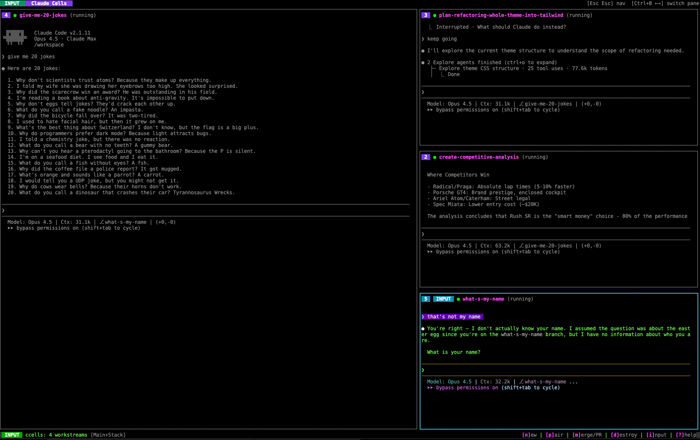

# Claude Cells

**Run multiple Claude Code instances in parallel, each in its own isolated Docker container with automatic git branch management.**

<p align="center">
  
</p>

> **Why another tool?** Other multi-agent orchestrators exist—but they all layer heavy GUIs on top, burying the Claude Code experience under their own interfaces. Claude Code's TUI is already best-in-class. We don't replace it; we multiply it. Claude Cells gives you the isolation and parallelism you need while keeping you in the terminal where you belong.

Claude Cells is a terminal multiplexer specifically designed for AI-assisted development. Spin up multiple Claude Code instances, each working on a different feature or bug fix in complete isolation, and watch them all progress simultaneously.

## Why Claude Cells?

- **Parallel Development**: Work on multiple features/bugs simultaneously without context switching
- **Complete Isolation**: Each Claude instance runs in its own Docker container with a dedicated git branch
- **No Conflicts**: Changes in one workstream can't interfere with another
- **Session Persistence**: Close ccells and come back later - containers pause and resume exactly where you left off
- **Real-time Collaboration**: Pairing mode syncs your local filesystem with any container for live editing

<p align="center">
  
</p>

## Features

### Core Capabilities

| Feature | Description |
|---------|-------------|
| **Parallel Workstreams** | Run multiple Claude Code sessions simultaneously, each working on different tasks |
| **Isolated Containers** | Each workstream runs in its own Docker container, preventing interference |
| **Automatic Branch Management** | Each workstream gets its own git branch, automatically named from your prompt |
| **Git Worktree Isolation** | Host repo stays untouched - each container uses its own worktree |
| **Session Persistence** | Quit and resume later - containers are paused and state is saved |
| **Push & PR** | Push branches and create pull requests directly from the TUI |
| **Pairing Mode** | Sync your local filesystem with a container using Mutagen for real-time collaboration |

### Layouts

Claude Cells supports multiple layout modes, accessible by pressing `L`:

- **Grid** - Equal-sized panes in a grid
- **Main+Stack** - Large main pane with smaller panes stacked on the right
- **Main+Row** - Large main pane with smaller panes in a row below
- **Rows** - Horizontal rows
- **Columns** - Vertical columns

Press `Space` to instantly swap any pane to the "main" (largest) position.

### Navigation

Two-mode interface inspired by Vim:

- **Nav Mode** (default): Navigate between panes, create/destroy workstreams, manage PRs
- **Input Mode**: Direct interaction with Claude Code in the focused pane

Switch modes with `i`/`Enter` to enter input mode, `Esc Esc` or `Ctrl+B Esc` to exit.

## Prerequisites

- **Docker** - Container runtime
- **Go 1.21+** - For building from source
- **[Mutagen](https://mutagen.io/)** - For pairing mode (optional)
- **[gh CLI](https://cli.github.com/)** - For PR creation (optional)
- **Claude Code** - Installed and authenticated on your system

## Installation

### From Source

```bash
git clone https://github.com/STRML/claude-cells.git
cd claude-cells
go build ./cmd/ccells
```

### Using Go Install

```bash
go install github.com/STRML/claude-cells/cmd/ccells@latest
```

## Quick Start

1. **Build the base Docker image** (first time only):
   ```bash
   docker build -t ccells-base -f configs/base.Dockerfile .
   ```

2. **Run ccells** from your project directory:
   ```bash
   ccells
   ```

3. **Create a workstream** by pressing `n` and entering a prompt for Claude:
   ```
   add user authentication with JWT tokens
   ```

4. **Watch Claude work** - the workstream will automatically:
   - Create a branch named `add-user-authentication-jwt-tokens`
   - Start a Docker container with your project mounted
   - Launch Claude Code with your prompt

5. **Create more workstreams** - press `n` again to add parallel tasks

## Keybindings

### Navigation Mode (default)

| Key | Action |
|-----|--------|
| `←` `→` `↑` `↓` | Switch between panes (spatial navigation) |
| `Tab` | Cycle focus to next pane |
| `1`-`9` | Focus pane by number |
| `Space` | Swap focused pane with main pane |
| `n` | New workstream |
| `d` | Destroy workstream |
| `p` | Toggle pairing mode |
| `m` | Merge/PR menu |
| `l` | View logs |
| `L` | Cycle layout mode |
| `s` | Settings |
| `?` | Show help |
| `i` / `Enter` | Enter input mode |
| `q` / `Ctrl+c` | Quit (pauses containers) |
| `Esc Esc` | Quit |

### Input Mode

| Key | Action |
|-----|--------|
| `Esc Esc` | Exit to navigation mode |
| `Ctrl+B` `Esc` | Exit to navigation mode |
| `Ctrl+B` `←`/`→`/`↑`/`↓` | Switch panes (tmux-style, stays in input mode) |
| `Ctrl+B` `1`-`9` | Switch pane by number |
| `Ctrl+c` | Send interrupt to Claude |
| All other keys | Sent directly to Claude Code |

## How It Works

### Workstream Lifecycle

```
┌─────────────────────────────────────────────────────────────────┐
│  1. Create Workstream                                           │
│     • Generate branch name from prompt (max 5 words)            │
│     • Create git worktree at /tmp/ccells/worktrees/<branch>     │
│     • Mount worktree into Docker container                      │
│     • Start Claude Code with your prompt                        │
├─────────────────────────────────────────────────────────────────┤
│  2. Isolation                                                   │
│     • Each container has its own git worktree                   │
│     • Host repo stays on its current branch (never changes!)    │
│     • Claude credentials mounted read-only                      │
│     • Changes isolated from other workstreams                   │
├─────────────────────────────────────────────────────────────────┤
│  3. Pairing Mode (optional)                                     │
│     • Mutagen syncs files bidirectionally                       │
│     • Edit locally while Claude works in container              │
│     • See changes in real-time                                  │
├─────────────────────────────────────────────────────────────────┤
│  4. Push & PR                                                   │
│     • Push branch to origin from the TUI                        │
│     • Create pull request with one keypress                     │
└─────────────────────────────────────────────────────────────────┘
```

### Git Worktree Isolation

Claude Cells uses **git worktrees** to achieve true isolation without modifying your host repository:

- Each container mounts a **separate worktree** (at `/tmp/ccells/worktrees/<branch>`)
- Your host repo stays on its current branch - never touched!
- No `.git/index.lock` conflicts when running multiple containers
- All worktrees share the same git objects (no disk bloat)
- Changes are part of the main repo's history (can push, create PRs)

### Session Persistence

When you quit ccells (`q` or `Ctrl+c`):
1. All containers are **paused** (not stopped)
2. State is saved to `.claude-cells/state.json`
3. PTY sessions are closed gracefully

When you restart ccells:
1. Containers are **resumed**
2. PTY sessions are reconnected
3. You're back exactly where you left off

## Architecture

```
claude-cells/
├── cmd/ccells/main.go         # Entry point
├── configs/base.Dockerfile    # Base Docker image
└── internal/
    ├── docker/                # Docker SDK wrapper
    │   └── client.go          # Container lifecycle management
    ├── git/                   # Git operations
    │   └── branch.go          # Branch & PR operations
    ├── sync/                  # File synchronization
    │   └── mutagen.go         # Mutagen pairing mode
    ├── tui/                   # Terminal UI (Bubble Tea)
    │   ├── app.go             # Main model & update loop
    │   ├── pane.go            # Workstream pane with vterm
    │   ├── pty.go             # Docker exec PTY sessions
    │   ├── dialog.go          # Modal dialogs
    │   ├── layout.go          # Pane layout calculations
    │   └── styles.go          # Styling
    └── workstream/            # Workstream state & lifecycle
        └── manager.go         # Workstream management
```

### Key Technologies

- **[Bubble Tea](https://github.com/charmbracelet/bubbletea)** - TUI framework
- **[Docker SDK](https://pkg.go.dev/github.com/docker/docker/client)** - Container management
- **[go-vterm](https://github.com/vterm/vterm)** - Virtual terminal emulation
- **[Mutagen](https://mutagen.io/)** - File synchronization

## Configuration

Claude Cells stores data in:

| Location | Purpose |
|----------|---------|
| `~/.claude-cells/` | Global config and Claude credential copies |
| `.claude-cells/state.json` | Session state for resume (in project directory) |
| `/tmp/ccells/worktrees/` | Git worktrees for container isolation |

## Troubleshooting

### Container fails to start

Make sure you've built the base image:
```bash
docker build -t ccells-base -f configs/base.Dockerfile .
```

### Claude Code not responding

Press `l` to view container logs. The startup process includes:
1. Container creation
2. Worktree creation
3. Claude Code initialization

If startup times out (default: 60s), check your Docker resources.

### Pairing mode not working

Ensure Mutagen is installed:
```bash
# macOS
brew install mutagen-io/mutagen/mutagen

# Other platforms: https://mutagen.io/documentation/introduction/installation
```

## Limitations

- Maximum of **12 concurrent workstreams** (configurable in code)
- Requires Docker Desktop or Docker Engine running
- Pairing mode requires Mutagen
- PR creation requires `gh` CLI authenticated

## License

MIT

## Contributing

Contributions welcome! Please:

1. Run tests: `go test -race ./...`
2. Run linter: `go vet ./...`
3. Format code: `gofmt -s -w .`
4. Ensure tests cover your changes
