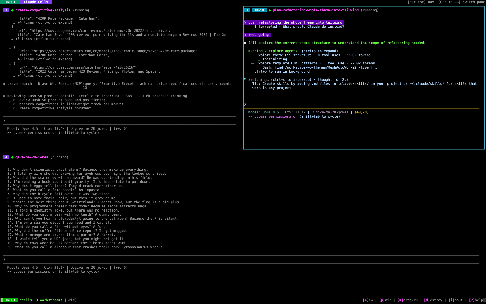

# Claude Cells

**Claude Code, behind bars.** Each instance runs in its own isolated cell—no conflicts, no permission prompts, no babysitting.

<p align="center">
  
</p>

> Other multi-agent tools wrap AI behind heavy custom UIs. We don't wrap Claude Code—**we put it in a cell**.

Claude Cells is a terminal multiplexer for AI-assisted development. Spin up Claude Code instances, each working on a different feature in complete isolation, and watch them all progress simultaneously.

## Why Claude Cells?

- **Total Isolation**: Each Claude runs in its own Docker container with its own git worktree. No `.git/index.lock` conflicts. No stepping on each other's toes.
- **Zero Permission Prompts**: Isolation means safety. Let Claude edit files, run commands, and iterate freely—it can't escape its cell.
- **Pure Claude Code**: No custom UI layer. You get Claude Code's excellent TUI, just tiled. Think tmux, not a framework.
- **Set It and Forget It**: Spin up a workstream, move on. Come back when it's done—containers pause and resume exactly where you left off.
- **Devcontainer Support**: Already have a `.devcontainer/devcontainer.json`? It just works.
- **Your Hardware is the Limit**: Run as many parallel workstreams as your machine can handle.
- **Real-time Pairing**: Sync your local filesystem with any container for live editing alongside Claude.

<p align="center">
  
</p>

## Features

### Core Capabilities

| Feature | Description |
|---------|-------------|
| **Parallel Workstreams** | Run multiple Claude Code sessions simultaneously, each working on different tasks |
| **Isolated Containers** | Each workstream runs in its own Docker container, preventing interference |
| **Automatic Branch Management** | Each workstream gets its own git branch, automatically named from your prompt |
| **Git Worktree Isolation** | Host repo stays untouched - each container uses its own worktree |
| **Session Persistence** | Quit and resume later - containers are paused and state is saved |
| **Push & PR** | Push branches and create pull requests directly from the TUI |
| **Pairing Mode** | Sync your local filesystem with a container using Mutagen for real-time collaboration |

### Layouts

Claude Cells supports multiple layout modes, accessible by pressing `L`:

- **Grid** - Equal-sized panes in a grid
- **Main+Stack** - Large main pane with smaller panes stacked on the right
- **Main+Row** - Large main pane with smaller panes in a row below
- **Rows** - Horizontal rows
- **Columns** - Vertical columns

Press `Space` to instantly swap any pane to the "main" (largest) position.

### Navigation

Two-mode interface inspired by Vim:

- **Nav Mode** (default): Navigate between panes, create/destroy workstreams, manage PRs
- **Input Mode**: Direct interaction with Claude Code in the focused pane

Switch modes with `i`/`Enter` to enter input mode, `Esc Esc` or `Ctrl+B Esc` to exit.

## Prerequisites

- **Docker runtime** - We recommend [OrbStack](https://orbstack.dev/) on macOS, or Docker Engine on Linux
- **Go 1.21+** - For building from source
- **[Mutagen](https://mutagen.io/)** - For pairing mode (optional)
- **[gh CLI](https://cli.github.com/)** - For PR creation (optional)
- **Claude Code** - Installed and authenticated on your system

## Installation

### From Source

```bash
git clone https://github.com/STRML/claude-cells.git
cd claude-cells
go build ./cmd/ccells
```

### Using Go Install

```bash
go install github.com/STRML/claude-cells/cmd/ccells@latest
```

## Quick Start

1. **Run ccells** from your project directory (the Docker image is built automatically on first run):
   ```bash
   ccells
   ```

2. **Create a workstream** by pressing `n` and entering a prompt for Claude:
   ```
   add user authentication with JWT tokens
   ```

3. **Watch Claude work** - the workstream will automatically:
   - Create a branch named `add-user-authentication-jwt-tokens`
   - Start a Docker container with your project mounted
   - Launch Claude Code with your prompt

4. **Create more workstreams** - press `n` again to add parallel tasks

## Keybindings

### Navigation Mode (default)

| Key | Action |
|-----|--------|
| `←` `→` `↑` `↓` | Switch between panes (spatial navigation) |
| `Tab` | Cycle focus to next pane |
| `1`-`9` | Focus pane by number |
| `Space` | Swap focused pane with main pane |
| `n` | New workstream |
| `d` | Destroy workstream |
| `p` | Toggle pairing mode |
| `m` | Merge/PR menu |
| `l` | View logs |
| `` ` `` | Toggle ccells logs (system logs panel) |
| `r` | View resource usage |
| `L` | Cycle layout mode |
| `s` | Settings |
| `?` | Show help |
| `i` / `Enter` | Enter input mode |
| `Ctrl+B` `m` | Toggle mouse mode (click-to-focus) |
| `q` / `Ctrl+c` | Quit (pauses containers) |
| `Esc Esc` | Quit |

### Input Mode

| Key | Action |
|-----|--------|
| `Esc Esc` | Exit to navigation mode |
| `Ctrl+B` `Esc` | Exit to navigation mode |
| `Ctrl+B` `←`/`→`/`↑`/`↓` | Switch panes (tmux-style, stays in input mode) |
| `Ctrl+B` `1`-`9` | Switch pane by number |
| `Ctrl+B` `m` | Toggle mouse mode (click-to-focus) |
| `Ctrl+c` | Send interrupt to Claude |
| All other keys | Sent directly to Claude Code |

### Mouse Support

Click on any pane to focus it and enter input mode. Mouse mode is **enabled by default**.

| Action | Description |
|--------|-------------|
| **Click** | Focus pane and enter input mode |
| **Option+Drag** (macOS) / **Shift+Drag** (Linux) | Select text (native terminal selection) |
| **Ctrl+B m** | Toggle mouse mode on/off |

When mouse mode is **OFF**, you can drag to select text without holding a modifier key, but click-to-focus is disabled.

## How It Works

Each workstream gets its own git worktree and Docker container. Your host repo stays untouched - no branch switching, no lock conflicts. When you press `n`, Claude Cells generates a branch name from your prompt, creates the worktree, and launches Claude Code.

### Pairing Mode

Press `p` to enable bidirectional file sync between your local filesystem and a container via [Mutagen](https://mutagen.io/). Edit locally while Claude works in the container.

```bash
# Install Mutagen
brew install mutagen-io/mutagen/mutagen  # macOS
```

### Session Persistence

Quit with `q` or `Ctrl+c` - containers pause and state auto-saves. Restart ccells to resume exactly where you left off.

### Container Security

Containers run with hardened security defaults (capability drops, no-new-privileges, process limits). If a container fails to start, settings auto-relax to find a working configuration.

See **[docs/CONTAINER-SECURITY.md](docs/CONTAINER-SECURITY.md)** for configuration options and security tiers.

## Architecture

```
claude-cells/
├── cmd/ccells/main.go         # Entry point
├── configs/base.Dockerfile    # Base Docker image
└── internal/
    ├── docker/                # Docker SDK wrapper
    │   └── client.go          # Container lifecycle management
    ├── git/                   # Git operations
    │   └── branch.go          # Branch & PR operations
    ├── sync/                  # File synchronization
    │   └── mutagen.go         # Mutagen pairing mode
    ├── tui/                   # Terminal UI (Bubble Tea)
    │   ├── app.go             # Main model & update loop
    │   ├── pane.go            # Workstream pane with vterm
    │   ├── pty.go             # Docker exec PTY sessions
    │   ├── dialog.go          # Modal dialogs
    │   ├── layout.go          # Pane layout calculations
    │   └── styles.go          # Styling
    └── workstream/            # Workstream state & lifecycle
        ├── manager.go         # In-memory workstream tracking
        ├── persistent_manager.go  # Auto-persisting state (wraps Manager)
        └── state.go           # State file operations
```

### Key Technologies

- **[Bubble Tea](https://github.com/charmbracelet/bubbletea)** - TUI framework
- **[Docker SDK](https://pkg.go.dev/github.com/docker/docker/client)** - Container management
- **[go-vterm](https://github.com/vterm/vterm)** - Virtual terminal emulation
- **[Mutagen](https://mutagen.io/)** - File synchronization

## Configuration

Claude Cells stores data in:

| Location | Purpose |
|----------|---------|
| `~/.claude-cells/config.yaml` | Global configuration (security, Dockerfile customization) |
| `~/.claude-cells/state/<repo-id>/` | Session state for resume (keyed by first commit hash, auto-saved) |
| `/tmp/ccells/worktrees/` | Git worktrees for container isolation |

### Dockerfile Customization

Customize what gets installed in container images via `~/.claude-cells/config.yaml`:

```yaml
dockerfile:
  inject:
    - "npm install -g ccstatusline"      # Installed by default
    - "apt-get update && apt-get install -y vim"
    - "pip install ipython"
```

Project-specific `.claude-cells/config.yaml` with `dockerfile.inject` replaces (not merges with) the global inject list.

## Troubleshooting

| Issue | Solution |
|-------|----------|
| Container fails to start | Rebuild image: `docker build -t ccells-base -f configs/base.Dockerfile .` |
| Claude Code not responding | Press `l` for logs; check Docker resources if startup times out |
| Pairing mode not working | Ensure Mutagen is installed: `mutagen version` |
| Sync conflicts | Check `mutagen sync list`, resolve in local editor |

## Limitations

- Requires a Docker runtime (we recommend [OrbStack](https://orbstack.dev/) on macOS)
- Pairing mode requires Mutagen
- PR creation requires `gh` CLI authenticated

## License

MIT

## Contributing

Contributions welcome! Please:

1. Run tests: `go test -race ./...`
2. Run linter: `go vet ./...`
3. Format code: `gofmt -s -w .`
4. Ensure tests cover your changes

See **[docs/TESTING.md](docs/TESTING.md)** for the full testing guide, including integration tests and manual verification procedures.
